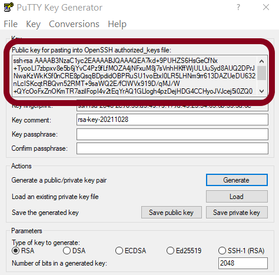
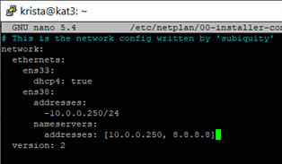
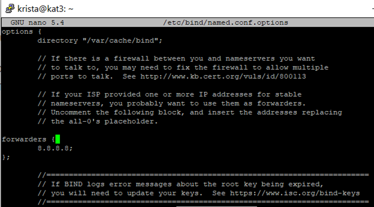
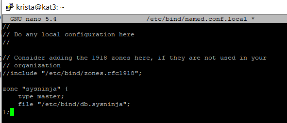
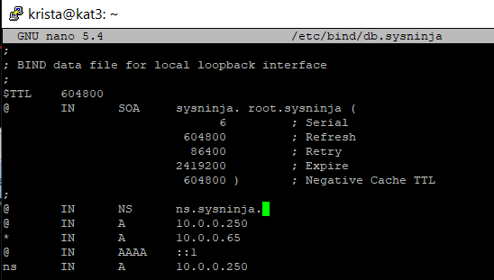
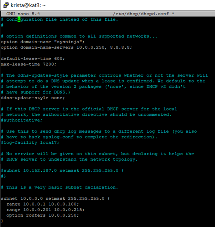
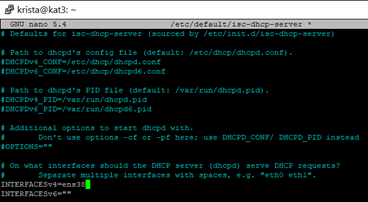

# Linux Server Set Up

[SSH Key](#ssh-key) | [NTP](#ntp-time-synchronization) | [Static IP Address](#static-internal-ip-address) | [DNS](#dns) | [DHCP](#dhcp) | [Firewall](#uncomplicated-firewall) | [IP Masquerading](#ip-masquerading) | [Squid](#squid-proxy-server)

## About

This is a basic setup for a Ubuntu 20.04 or 21.10 server. More information on Ubuntu Server can be found at [Ubuntu's Website](https://ubuntu.com/server). This particular build was completed on VMWare Workstation Pro.
*****************

## Server Services

This guide will go through:
- Setting up a key with PuTTYgen to SSH into the server
- Synchronizing the server clock with NTP servers
- Completing a static IP address set up
- Installing and configuring DNS as well as making a private domain
- Installing and configuring DHCP to hand out IP addresses to clients
- Creating a basic firewall using Linux's Uncomplicated Firewall (ufw)
- Setting up IP masquerading from an internal network to an external network
- Installing and configuring a proxy service using squid
*****************

## Requirements

A Ubuntu 20.04 or 21.10 server with two network adapters (one for an internal network and one for an external network) and a client machine on the internal network will be required.
*****************

## SSH Key 

If OpenSSH was not installed during the Ubuntu installation process it should be installed prior to setting up a key for SSH access. This can be done via the command:  

`sudo apt install openssh-server openssh-client`  

This service should begin to run once installed and can be confirmed by the command:  

`sudo systemctl status ssh`  

Once OpenSSH has been installed it can have a key act as authorization to access the system. In this case, the key was generated in PuTTYgen.

 

After generating a key, the private key should be saved on the client that will be accessing the server. The public key should be copied from the text field circled in the image below:

 

An SSH session should be opened to the Ubuntu server at this point. Once connected by the username and password desired to be associated with the key the following steps should be completed:  
1. Make a directory: `mkdir ~/.ssh` 
2. Make a file in the newly created directory: `touch ~/.ssh/authorized_keys`
3. Edit this file: `nano ~/.ssh/authorized_keys`
4. Copy the public key into this file.

The key should now be authorized by the server to authenticate SSH sessions from this client.
*****************

## NTP Time Synchronization
To ensure that the server's log times are correct the system time should be synchronized with an NTP server. To set this up:
- Install chrony via the command `sudo apt install chrony`  
  
If desired, the configuration file can be edited to change which NTP servers are being used. This can be done in the `/etc/chrony/chrony.conf` file. Should this file be changed the service must be restarted using:  
`sudo systemctl restart chrony.service`
*****************

## Static Internal IP Address

The interface which the static IP address will be assigned to must be identified. The `ip a` command will list the interfaces attached to the Ubuntu server. In this case, the two interfaces were ens33 which was the machine's external network interface and ens38 which needed to be set up as the internal network interface. This is done by editing the netplan configuration file.  

`sudo nano /etc/netplan/00-installer-config.yaml`  

The text file of this configuration is located [here](static/00-installer-config.txt) and should look like the image below once entered.  

Once this file has been properly configured it must be applied to the system via `sudo netplan apply`
*****************

## DNS
To get a Domain Name server installed on Ubuntu two installs are recommended:
- `sudo apt install bind9`
- `sudo apt install dnsutils` 

Once these have been installed the DNS files must be configured. These files include:

- the `/etc/bind/named.conf` file (which is left in its default state)
- the `/etc/bind/named.conf.options` file which is edited to forward requests to an external DNS server (Google in this case at 8.8.8.8)  

- the `/etc/bind/named.conf.local` file is where your local zone information should be added. The text file is [here](dns/zone.txt) and should look like the example below.  

- the zone file itself. To create this file the command `sudo cp /etc/bind/db.local /etc/bind/db.sysninja` is used to copy the local zone file to a custom zone file (in this case "sysninja"). Once created, this file (`/etc/bind/db.sysninja`) needs to be configured for the new zone. Each time this file is changed, the serial number located on line 6 should be changed as well. The text for the configuration used on this machine is [here](dns/zonefile.txt) and should look like the image below when completed.

Once these files are configured the DNS service needs to be restarted with the command: 
To check the status of the service and make certain it is running use:  
`sudo systemctl status bind9.service`  
At this point, the client should be able to use the DNS server to `nslookup` the addresses in the configured zone (ie: ns.sysninja).

*****************

## DHCP

Setting up DHCP to automatically assign IP addresses to clients on the internal network is the next step. To do this the following should be installed:  
`sudo apt-get install isc-dhcp-server`    
After installation, the DHCP file must be configured:  
`sudo nano /etc/dhcp/dhcpd.conf`    
This configuration is copied in text format [here](dhcp/dhcp.txt) and should look like the following image.

This outlines the network the clients will be on and the range of IP addresses that will be handed out by the DHCP service.    

After the configuration of the network and range is complete, the DHCP server will likely need to be configured so it knows which interface it will be using. This change will be entered into the `/etc/default/isc-dhcp-server` file. In this case, the interface was ens38 as seen below.

The DHCP service should be restarted once it has been configured using the command:  
`sudo systemctl restart isc-dhcp-server.service`    

The status can be checked via:  
`sudo systemctl status isc-dhcp-server.service`    

The client should now be getting an IP address from the server's DHCP!

*****************

## Uncomplicated Firewall

*****************

## IP Masquerading

*****************

## Squid Proxy Server

*****************

saved for later use

## MD file

 
