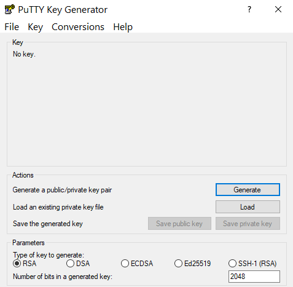
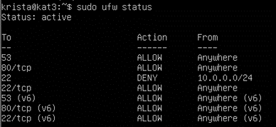
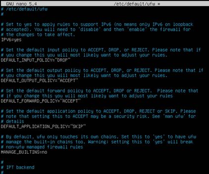
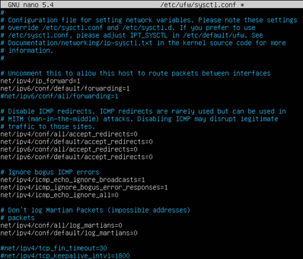
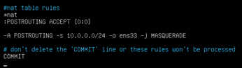

# Linux Server Set Up

[SSH Key](#ssh-key) | [NTP](#ntp-time-synchronization) | [Static IP Address](#static-internal-ip-address) | [DNS](#dns) | [DHCP](#dhcp) | [Firewall](#uncomplicated-firewall) | [IP Masquerading](#ip-masquerading) | [Squid](#squid-proxy-server)

## About

This is a basic setup for a Ubuntu 20.04 or 21.10 server. More information on Ubuntu Server can be found at [Ubuntu's Website](https://ubuntu.com/server). This particular build was completed on VMWare Workstation Pro.
*****************

## Server Services

This guide will go through:
- Setting up a key with PuTTYgen to SSH into the server
- Synchronizing the server clock with NTP servers
- Completing a static IP address set up
- Installing and configuring DNS as well as making a private domain
- Installing and configuring DHCP to hand out IP addresses to clients
- Creating a basic firewall using Linux's Uncomplicated Firewall (ufw)
- Setting up IP masquerading from an internal network to an external network
- Installing and configuring a proxy service using squid
*****************

## Requirements

A Ubuntu 20.04 or 21.10 server with two network adapters (one for an internal network and one for an external network) and a client machine on the internal network will be required.
*****************

## SSH Key 

If OpenSSH was not installed during the Ubuntu installation process it should be installed prior to setting up a key for SSH access. This can be done via the command:  

`sudo apt install openssh-server openssh-client`  

This service should begin to run once installed and can be confirmed by the command:  

`sudo systemctl status ssh`  

Once OpenSSH has been installed it can have a key act as authorization to access the system. In this case, the key was generated in PuTTYgen.

 

After generating a key, the private key should be saved on the client that will be accessing the server. The public key should be copied from the text field circled in the image below:

 

An SSH session should be opened to the Ubuntu server at this point. Once connected by the username and password desired to be associated with the key the following steps should be completed:  
1. Make a directory: `mkdir ~/.ssh` 
2. Make a file in the newly created directory: `touch ~/.ssh/authorized_keys`
3. Edit this file: `nano ~/.ssh/authorized_keys`
4. Copy the public key into this file.

The key should now be authorized by the server to authenticate SSH sessions from this client.

More information on SSH keys and some troubleshooting tips can be found [here](https://www.ssh.com/academy/ssh/copy-id).
*****************

## NTP Time Synchronization
To ensure that the server's log times are correct the system time should be synchronized with an NTP server. To set this up:
- Install chrony via the command `sudo apt install chrony`  
  
If desired, the configuration file can be edited to change which NTP servers are being used. This can be done in the `/etc/chrony/chrony.conf` file. Should this file be changed the service must be restarted using:  
`sudo systemctl restart chrony.service`

More information and examples of chrony configurations can be found [here](https://chrony.tuxfamily.org/doc/4.1/chrony.conf.html#examples).
*****************

## Static Internal IP Address

The interface which the static IP address will be assigned to must be identified. The `ip a` command will list the interfaces attached to the Ubuntu server. In this case, the two interfaces were ens33 which was the machine's external network interface and ens38 which needed to be set up as the internal network interface. This is done by editing the netplan configuration file.  

`sudo nano /etc/netplan/00-installer-config.yaml`  

The text file of this configuration is located [here](static/00-installer-config.txt) and should look like the image below once entered.  

Once this file has been properly configured it must be applied to the system via `sudo netplan apply`

More information on network plans can be found on the [Ubuntu website](https://ubuntu.com/server/docs/network-configuration).

*****************

## DNS
To get a Domain Name server installed on Ubuntu two installs are recommended:
- `sudo apt install bind9`
- `sudo apt install dnsutils` 

Once these have been installed the DNS files must be configured. These files include:

- the `/etc/bind/named.conf` file (which is left in its default state)
- the `/etc/bind/named.conf.options` file which is edited to forward requests to an external DNS server (Google in this case at 8.8.8.8)  

- the `/etc/bind/named.conf.local` file is where your local zone information should be added. The text file is [here](dns/zone.txt) and should look like the example below.  

- the zone file itself. To create this file the command `sudo cp /etc/bind/db.local /etc/bind/db.sysninja` is used to copy the local zone file to a custom zone file (in this case "sysninja"). Once created, this file (`/etc/bind/db.sysninja`) needs to be configured for the new zone. Each time this file is changed, the serial number located on line 6 should be changed as well. The text for the configuration used on this machine is [here](dns/zonefile.txt) and should look like the image below when completed.

Once these files are configured the DNS service needs to be restarted with the command: 
`sudo systemctl restart bind9.service`    
To check the status of the service and make certain it is running use:  
`sudo systemctl status bind9.service`    
At this point, the client should be able to use the DNS server to `nslookup` the addresses in the configured zone (ie: ns.sysninja).

More information can be found at [Ubuntu](https://ubuntu.com/server/docs/service-domain-name-service-dns). To check out best practices when it comes to DNS servers (which are recommended to be on their own server) click [here](https://kb.isc.org/docs/bind-best-practices-recursive).

*****************

## DHCP

Setting up DHCP to automatically assign IP addresses to clients on the internal network is the next step. To do this the following should be installed:  
`sudo apt-get install isc-dhcp-server`    
After installation, the DHCP file must be configured:  
`sudo nano /etc/dhcp/dhcpd.conf`    
This configuration is copied in text format [here](dhcp/dhcp.txt) and should look like the following image.

This outlines the network the clients will be on and the range of IP addresses that will be handed out by the DHCP service.    

After the configuration of the network and range is complete, the DHCP server will likely need to be configured so it knows which interface it will be using. This change will be entered into the `/etc/default/isc-dhcp-server` file. In this case, the interface was ens38 as seen below.

The DHCP service should be restarted once it has been configured using the command:  
`sudo systemctl restart isc-dhcp-server.service`    

The status can be checked via:  
`sudo systemctl status isc-dhcp-server.service`    

The client should now be getting an IP address from the server's DHCP!

Having DHCP trouble? Check this [Ubuntu Forum post](https://help.ubuntu.com/community/isc-dhcp-server) for help.

*****************

## Uncomplicated Firewall

Linux has built in firewall capabilities which can be enabled with the command:  
`sudo ufw enable`  

Once this has been enabled firewall rules can be added to control the traffic in and out of the server. Examples of these rules can be found below:

`sudo ufw allow 53`

`sudo ufw allow http`

`sudo ufw deny from 10.0.0.0/24 to any port 22`

`sudo allow ssh`

Order matters when creating these rules! The command below can be used to see which rules have been created and their order:

`sudo ufw status`  
This will give an output similar to the one seen below:

*****************

## IP Masquerading

IP masquerading allows internal network traffic to be translated into addresses that are understood outside of their network. To set this up, the `/etc/default/ufw` file needs to be edited to ACCEPT for the default forwarding policy as shown in the image below.

After this has been edited, the file `/etc/ufw/sysctl.conf` will need to be changed. Two comments need to active:
- net/ipv4/ip_forward=1
- net/ipv6/conf/default/forwarding=1  

Which will leave this configuration resembling the image below. 

Now that packets are allowed to be forwarded in both IPv4 and IPv6 it is time to create the rule that will direct the packets from one network to the next. This rule should be entered in the top of the `/etc/ufw/before.rules` file. In this case, the packets were traveling from a 10.0.0.0/24 network out to the external network through interface ens33. The image below displays the NAT table rule used for this server while the text version can be found [here](ipmask/nat.txt).

This rule is an iptables rule which means it is not persistant should the service be interrupted. To make it persistant the command
`sudo apt-get install iptables -persistant` should be used. Once this rule has been added the firewall should be turned off and on again via:  
`sudo ufw disable && sudo ufw enable`  

The clients should now be able to access the internet!

For the Ubuntu instructions on firewalls and IP masquerading click [here](https://ubuntu.com/server/docs/security-firewall).

*****************

## Squid Proxy Server

Setting up a proxy server between the clients on the internal network and the external network will allow for more traffic control. In this case, a proxy server was used to block access to a website from the client computer. To do this squid should be installed via:  

`sudo apt install squid`  

Squid defaults to port 3128 which means this port needs to have the desired traffic redirected to it. This is done by the command  

`sudo iptables -t nat -I PREROUTING -p tcp -s 10.0.0.0/24 --dport 80 -j REDIRECT --to-port 3128`  
As with the other iptable rule, this will not be persistant until the command `sudo apt-get install iptables -persistant` is run.  

To block a website it must first have its URL added to the `/etc/squid/denied-sites.squid`. 

The size of the squid configuration file is quite large. It is suggested to make a copy of the default configuration in case something goes awry via  

`sudo cp /etc/squid/squid.conf /etc/squid/squid.conf.original`  

The configuration file `/etc/squid/squid.conf` can then be edited. The default ACLs should be checked to ensure that they allow the networks as desired. The allowed network defaults were of wider networks than needed but worked for this purpose and were left alone. Below these ACLs a rule should be added to deny the websites listed in the file above. This ACL should be:  

`acl deniedsites dstdomain "/etc/squid/denied-sites.squid"`  

The list of ACLs from this setup is shown below.

To block the http traffic from these sites the following two lines were added farther down in the configuration file:  
`#Deny access to blocked sites`  
`http_access deny deniedsites`

This is shown in the image below:

Finally, the option to change which port the proxy server is using is located farther down in this configuration file. In this case, it was left at the default port 3128. If this is changed, it must also be changed in the iptables rule that was set above.  

This port also must be allowed through the firewall. To add this allowance the rule below must be added.  
`sudo ufw allow 3128`  

Once the configuration is complete, squid must be restarted.  

`sudo systemctl restart squid.service`  

The client machine should no longer be able to access the websites listed in the deniedsites file and the proxy server should be creating traffic logs.

More information about Squid can be found on the [Ubuntu website](https://ubuntu.com/server/docs/proxy-servers-squid).

*****************